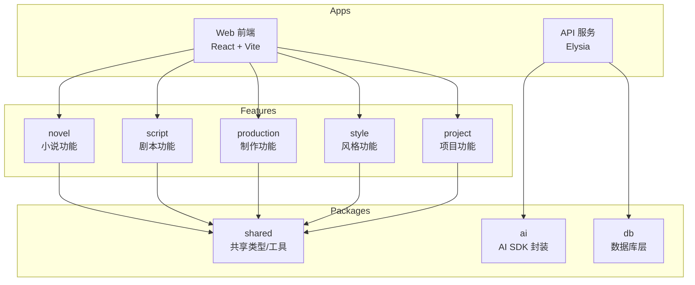

# Context Map

This file routes skills to area-specific domain contexts.

## 项目结构

## Areas

- [Web Frontend](./apps/web/CONTEXT.md)
- [API Server](./apps/server/CONTEXT.md)

## Documentation

- [ADR](./docs/adr/) - Architecture Decision Records
- [Glossary](./docs/glossary/glossary.md) - 术语表
- [Roadmap](./docs/ROADMAP.md) - 开发路线图

## Features

- [Novel](./apps/web/src/features/novel/) - 小说功能
- [Script](./apps/web/src/features/script/) - 剧本功能
- [Production](./apps/web/src/features/production/) - 制作功能
- [Style](./apps/web/src/features/style/) - 风格功能
- [Project](./apps/web/src/features/project/) - 项目功能
