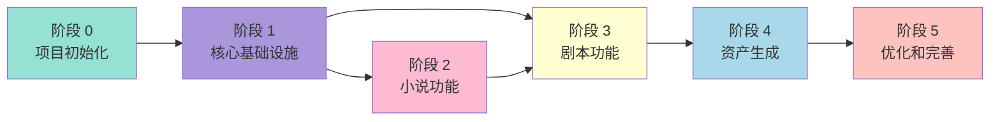
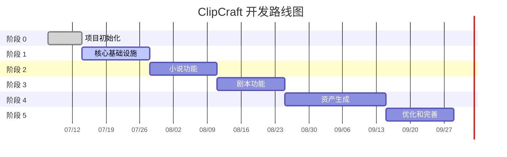

# ClipCraft 开发路线图

## 阶段依赖关系



## 阶段 0：项目初始化（第 1 周）

### 目标
搭建 Monorepo 基础架构，配置开发环境。

### 任务清单

- [ ] 初始化 Turborepo + Bun 项目
- [ ] 配置 BiomeJS（lint + format）
- [ ] 配置 TypeScript
- [ ] 设置 Git hooks（husky + lint-staged）
- [ ] 创建基础目录结构
- [ ] 配置 CI/CD（GitHub Actions）

### 交付物

```
clipcraft/
├── apps/
│   ├── web/           # 空的 React + Vite 应用
│   └── server/        # 空的 Elysia 应用
├── packages/
│   ├── shared/        # 共享类型
│   ├── tsconfig/      # 共享 TS 配置
│   └── biome/         # 共享 Biome 配置
├── turbo.json
├── package.json
└── bun.lockb
```

---

## 阶段 1：核心基础设施（第 2-3 周）

### 目标
实现数据层、AI 层、API 基础框架。

### 任务清单

- [ ] 实现数据库层（Drizzle + SQLite）
  - [ ] 定义 Schema
  - [ ] 实现 Migration
  - [ ] 封装 Repository
- [ ] 实现 AI 层（Vercel AI SDK）
  - [ ] 供应商配置
  - [ ] 统一调用接口
  - [ ] 流式响应支持
- [ ] 实现 API 基础框架（Elysia）
  - [ ] 中间件（错误处理、日志、CORS）
  - [ ] 路由组织
  - [ ] WebSocket 支持
- [ ] 实现前端基础框架（React + Vite）
  - [ ] 路由配置
  - [ ] 状态管理
  - [ ] API 客户端

### 交付物

```
packages/
├── db/                # 数据库层
│   ├── src/
│   │   ├── schema.ts  # Drizzle Schema
│   │   ├── client.ts  # 数据库连接
│   │   └── repos/     # Repository 实现
│   └── package.json
├── ai/                # AI 层
│   ├── src/
│   │   ├── providers.ts
│   │   ├── generate.ts
│   │   └── stream.ts
│   └── package.json
└── shared/            # 共享类型和工具
    ├── src/
    │   ├── types/
    │   └── utils/
    └── package.json
```

---

## 阶段 2：小说功能（第 4-5 周）

### 目标
实现小说的导入、编辑、管理功能。

### 任务清单

- [ ] 实现 novel feature
  - [ ] 小说列表页面
  - [ ] 小说详情页面
  - [ ] 小说编辑器
  - [ ] 小说导入（TXT、EPUB）
- [ ] 实现 project feature
  - [ ] 项目列表页面
  - [ ] 项目创建/编辑
  - [ ] 项目详情页面
- [ ] 实现 API 端点
  - [ ] CRUD 操作
  - [ ] 文件上传
  - [ ] 搜索功能

### 交付物

```
apps/web/src/features/
├── novel/
│   ├── components/
│   │   ├── NovelList.tsx
│   │   ├── NovelDetail.tsx
│   │   └── NovelEditor.tsx
│   ├── hooks/
│   │   ├── useNovel.ts
│   │   └── useNovelList.ts
│   └── api/
│       └── novel.api.ts
└── project/
    ├── components/
    │   ├── ProjectList.tsx
    │   └── ProjectDetail.tsx
    └── hooks/
        └── useProject.ts
```

---

## 阶段 3：剧本功能（第 6-7 周）

### 目标
实现小说转剧本的 AI 生成功能。

### 任务清单

- [ ] 实现 script feature
  - [ ] 剧本列表页面
  - [ ] 剧本详情页面
  - [ ] 剧本编辑器
- [ ] 实现 scriptAgent
  - [ ] 小说分析
  - [ ] 场景拆分
  - [ ] 对话生成
  - [ ] 视觉描述生成
- [ ] 实现流式显示
  - [ ] 打字机效果
  - [ ] 实时进度

### 交付物

```
apps/web/src/features/
└── script/
    ├── components/
    │   ├── ScriptList.tsx
    │   ├── ScriptDetail.tsx
    │   ├── ScriptEditor.tsx
    │   └── StreamDisplay.tsx
    ├── hooks/
    │   ├── useScript.ts
    │   └── useScriptGeneration.ts
    └── api/
        └── script.api.ts

apps/server/src/features/
└── script/
    ├── script.route.ts
    ├── script.service.ts
    └── scriptAgent.ts
```

---

## 阶段 4：资产生成（第 8-10 周）

### 目标
实现图片、视频、音频的 AI 生成功能。

### 任务清单

- [ ] 实现 style feature
  - [ ] 风格列表页面
  - [ ] 风格编辑器
  - [ ] 风格预览
- [ ] 实现 asset generation
  - [ ] 图片生成（DALL-E、Midjourney API）
  - [ ] 视频生成（Runway、Pika API）
  - [ ] 音频生成（ElevenLabs API）
- [ ] 实现 production feature
  - [ ] 场景时间线
  - [ ] 资产预览
  - [ ] 批量生成

### 交付物

```
apps/web/src/features/
├── style/
│   ├── components/
│   │   ├── StyleList.tsx
│   │   └── StyleEditor.tsx
│   └── hooks/
│       └── useStyle.ts
└── production/
    ├── components/
    │   ├── Timeline.tsx
    │   ├── AssetPreview.tsx
    │   └── BatchGenerate.tsx
    └── hooks/
        └── useProduction.ts
```

---

## 阶段 5：优化和完善（第 11-12 周）

### 目标
性能优化、用户体验改进、文档完善。

### 任务清单

- [ ] 性能优化
  - [ ] 懒加载
  - [ ] 缓存策略
  - [ ] 数据库索引
- [ ] 用户体验
  - [ ] 错误处理
  - [ ] 加载状态
  - [ ] 快捷键
- [ ] 文档
  - [ ] 用户文档
  - [ ] 开发文档
  - [ ] API 文档
- [ ] 测试
  - [ ] 单元测试
  - [ ] 集成测试
  - [ ] E2E 测试

---

## 里程碑

| 阶段 | 时间 | 里程碑 |
|------|------|--------|
| 0 | 第 1 周 | Monorepo 搭建完成 |
| 1 | 第 2-3 周 | 核心基础设施就绪 |
| 2 | 第 4-5 周 | 小说功能可用 |
| 3 | 第 6-7 周 | 剧本生成功能可用 |
| 4 | 第 8-10 周 | 资产生成功能可用 |
| 5 | 第 11-12 周 | v1.0 发布 |

### 时间线



---

## 技术债务管理

每个阶段结束后，预留 1-2 天处理技术债务：
- 重构不符合规范的代码
- 补充缺失的测试
- 更新文档
- 修复已知问题
