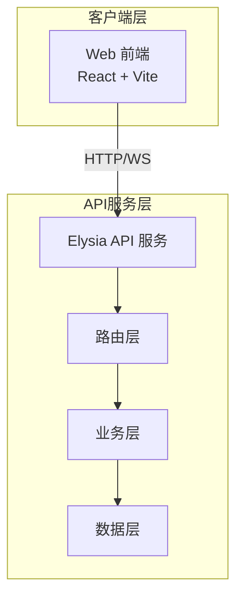

# ADR-002: 前后端分离

## 状态

已接受

## 背景

Toonflow 采用 Express + 模板渲染的方式，前后端耦合紧密。ClipCraft 需要更好的架构来支持 Web 应用。

## 决策

- **前端**：React + Vite + BiomeJS
- **后端**：Elysia (Bun 原生框架)
- **通信**：RESTful API + WebSocket

## 理由

### 前端选择

| 技术 | 选择理由 |
|------|----------|
| **React** | 生态最成熟，组件库丰富，Toonflow 也用 React |
| **Vite** | 开发体验极佳，HMR 快，构建快 |
| **BiomeJS** | 替代 ESLint + Prettier，速度更快，配置更简单 |

### 后端选择

| 技术 | 选择理由 |
|------|----------|
| **Elysia** | Bun 原生框架，性能优秀，类型安全，API 设计优雅 |
| **Bun** | 比 Node.js 快 3-5 倍，原生 TypeScript，内置工具链 |

## 架构

## 后果

### 正面

- 前后端独立开发、部署
- 多端复用同一套 API
- 更好的可测试性
- 清晰的职责分离

### 负面

- 需要处理跨域（CORS）
- API 版本管理
- 状态管理复杂度增加

## 相关决策

- ADR-001: Monorepo 架构
- ADR-003: 桌面客户端方案
