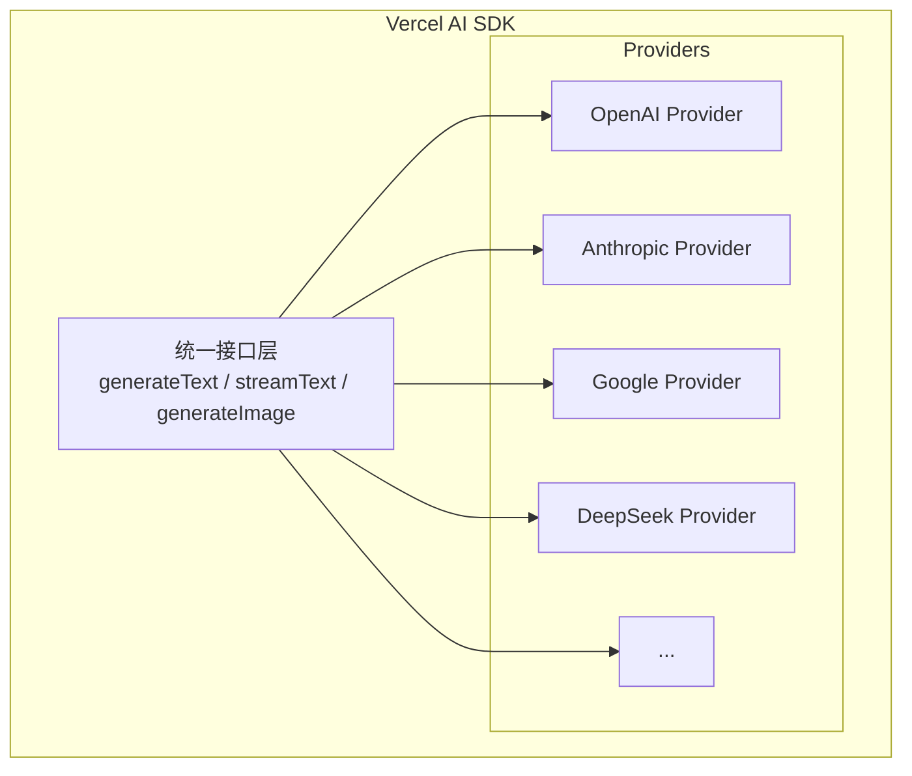

# ADR-004: AI 多供应商架构

## 状态

已接受

## 背景

Toonflow 支持多个 AI 提供商（OpenAI、Anthropic、Google、DeepSeek 等），但实现方式较为原始，缺乏统一抽象。ClipCraft 需要更好的 AI 架构。

## 决策

- 采用 **Vercel AI SDK** 作为统一 AI 抽象层
- 保持 **多供应商策略**
- 实现 **可插拔的供应商配置**

## 理由

### Vercel AI SDK 优势

| 特性 | 说明 |
|------|------|
| **统一 API** | 一套代码支持 OpenAI、Anthropic、Google 等 |
| **流式响应** | 原生支持流式文本生成 |
| **工具调用** | 支持 Function Calling / Tool Use |
| **类型安全** | 完整的 TypeScript 类型定义 |
| **活跃维护** | Vercel 官方维护，更新频繁 |

### 多供应商策略



## 实现

### 供应商配置

```typescript
// packages/ai/src/providers.ts
import { createOpenAI } from '@ai-sdk/openai'
import { createAnthropic } from '@ai-sdk/anthropic'
import { createGoogleGenerativeAI } from '@ai-sdk/google'

export const providers = {
  openai: createOpenAI({ apiKey: process.env.OPENAI_API_KEY }),
  anthropic: createAnthropic({ apiKey: process.env.ANTHROPIC_API_KEY }),
  google: createGoogleGenerativeAI({ apiKey: process.env.GOOGLE_API_KEY }),
} as const

export type ProviderName = keyof typeof providers
```

### 统一调用

```typescript
// packages/ai/src/generate.ts
import { generateText, streamText } from 'ai'
import { providers, type ProviderName } from './providers'

interface GenerateOptions {
  provider: ProviderName
  model: string
  prompt: string
  system?: string
}

export async function generate(options: GenerateOptions) {
  const provider = providers[options.provider]
  return generateText({
    model: provider(options.model),
    prompt: options.prompt,
    system: options.system,
  })
}
```

### 供应商选择策略

```typescript
// packages/ai/src/strategy.ts
interface ProviderConfig {
  name: ProviderName
  model: string
  maxTokens: number
  costPer1k: number
  speed: 'fast' | 'medium' | 'slow'
}

// 根据任务类型选择最优供应商
export function selectProvider(task: 'script' | 'image' | 'video'): ProviderConfig {
  const configs: Record<string, ProviderConfig[]> = {
    script: [
      { name: 'anthropic', model: 'claude-3-sonnet', maxTokens: 4096, costPer1k: 0.003, speed: 'medium' },
      { name: 'openai', model: 'gpt-4o', maxTokens: 4096, costPer1k: 0.005, speed: 'fast' },
    ],
    image: [
      { name: 'openai', model: 'dall-e-3', maxTokens: 0, costPer1k: 0.04, speed: 'medium' },
      { name: 'google', model: 'imagen-3', maxTokens: 0, costPer1k: 0.03, speed: 'fast' },
    ],
    // ...
  }
  return configs[task][0]
}
```

## 后果

### 正面

- 统一的 AI 调用接口
- 易于添加新供应商
- 类型安全
- 流式响应支持
- 成本优化空间

### 负面

- 依赖第三方库
- 需要管理多个 API Key
- 供应商 API 变化需要跟进

## 相关决策

- ADR-005: Feature-Based 架构
