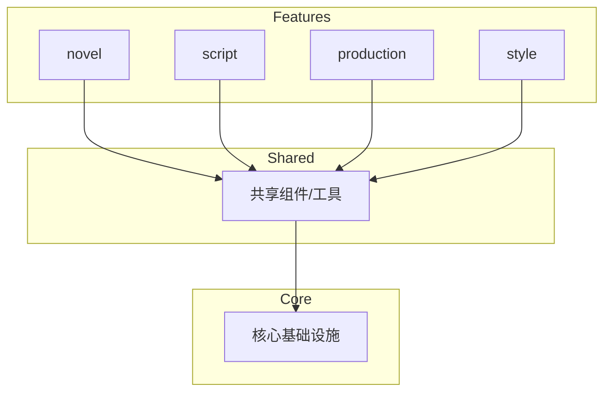

# ADR-005: Feature-Based 架构

## 状态

已接受

## 背景

Toonflow 采用传统的分层架构（routes/utils/middleware），导致业务逻辑分散，难以维护。ClipCraft 需要更好的代码组织方式。

## 决策

采用 **Feature-Based 架构**，按业务功能组织代码，而非按技术层。

## 架构设计

### 传统分层 vs Feature-Based

```
❌ 传统分层（Toonflow）
src/
├── routes/           # 所有路由混在一起
│   ├── novel/
│   ├── script/
│   ├── production/
│   └── ...
├── utils/            # 工具函数垃圾场
├── middleware/        # 中间件
└── types/            # 类型定义

✅ Feature-Based（ClipCraft）
src/
├── features/         # 按业务功能划分
│   ├── novel/        # 小说功能
│   │   ├── api/      # 该功能的 API
│   │   ├── components/ # 该功能的组件
│   │   ├── hooks/    # 该功能的 Hooks
│   │   ├── stores/   # 该功能的状态
│   │   ├── types/    # 该功能的类型
│   │   └── utils/    # 该功能的工具
│   ├── script/       # 剧本功能
│   ├── production/   # 制作功能
│   ├── style/        # 风格功能
│   └── project/      # 项目功能
├── shared/           # 跨功能共享
│   ├── components/
│   ├── hooks/
│   ├── utils/
│   └── types/
└── core/             # 核心基础设施
    ├── api/          # API 客户端
    ├── db/           # 数据库
    ├── ai/           # AI 服务
    └── config/       # 配置
```

### Feature 内部结构

```
features/novel/
├── api/
│   ├── novel.api.ts        # API 调用
│   └── novel.mock.ts       # Mock 数据
├── components/
│   ├── NovelList.tsx        # 小说列表
│   ├── NovelDetail.tsx      # 小说详情
│   └── NovelEditor.tsx      # 小说编辑器
├── hooks/
│   ├── useNovel.ts          # 小说 Hook
│   └── useNovelList.ts      # 小说列表 Hook
├── stores/
│   └── novel.store.ts       # 小说状态
├── types/
│   └── novel.types.ts       # 小说类型
├── utils/
│   └── novel.utils.ts       # 小说工具
└── index.ts                 # 公共导出
```

## 原则

### 1. 高内聚，低耦合

```typescript
// ✅ Feature 内部可以自由引用
// features/novel/components/NovelList.tsx
import { useNovelList } from '../hooks/useNovelList'
import { NovelCard } from './NovelCard'

// ❌ Feature 之间不能直接引用
// features/script/components/ScriptEditor.tsx
import { useNovel } from '../../novel/hooks/useNovel'  // 禁止！

// ✅ 通过共享层或事件通信
import { useNovel } from '@/shared/hooks/useNovel'
```

### 2. 依赖方向



### 3. 公共 API 边界

```typescript
// features/novel/index.ts
// 只导出其他 Feature 需要的内容
export { useNovel } from './hooks/useNovel'
export { NovelList } from './components/NovelList'
export type { Novel } from './types/novel.types'

// 内部实现不导出
// export { novelStore } from './stores/novel.store'  // 不导出
```

## 后果

### 正面

- 业务逻辑内聚，易于理解和维护
- Feature 可独立开发、测试、部署
- 新人上手快（按功能查找代码）
- 重构影响范围可控

### 负面

- 需要严格遵守依赖规则
- 跨 Feature 通信需要额外设计
- 可能有少量代码重复

## 相关决策

- ADR-001: Monorepo 架构
- ADR-006: 数据存储方案
