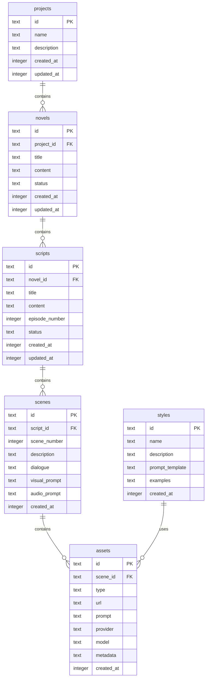

# ADR-006: 数据存储方案

## 状态

已接受

## 背景

Toonflow 使用 SQLite 作为本地数据库。ClipCraft 需要选择合适的数据存储方案，支持 Web 应用的开发和部署。

## 决策

采用 **SQLite** 作为主要存储，使用 **Drizzle ORM** 作为数据库访问层。

## 理由

### SQLite 优势

| 特性 | 说明 |
|------|------|
| **零配置** | 无需安装数据库服务器 |
| **离线优先** | 数据存储在本地，无需网络 |
| **性能好** | 读取速度快，适合单用户场景 |
| **可靠性** | 久经考验，稳定可靠 |
| **跨平台** | 所有平台都支持 |

### Drizzle ORM 选择

| ORM | 类型安全 | 性能 | 学习成本 | SQL 控制 |
|-----|----------|------|----------|----------|
| Prisma | ✅ | 中 | 中 | 低 |
| **Drizzle** | ✅ | **高** | **低** | **高** |
| TypeORM | 中 | 中 | 中 | 中 |
| Knex | ❌ | 高 | 低 | 高 |

**Drizzle 优势**：
1. 类型安全，SQL-like API
2. 性能接近原生 SQL
3. 支持 SQLite/PostgreSQL/MySQL
4. 轻量，无运行时开销

## 数据库设计

### ER 图



### 核心表

```sql
-- 项目表
CREATE TABLE projects (
  id TEXT PRIMARY KEY,
  name TEXT NOT NULL,
  description TEXT,
  created_at INTEGER DEFAULT (unixepoch()),
  updated_at INTEGER DEFAULT (unixepoch())
);

-- 小说表
CREATE TABLE novels (
  id TEXT PRIMARY KEY,
  project_id TEXT NOT NULL REFERENCES projects(id),
  title TEXT NOT NULL,
  content TEXT,
  status TEXT DEFAULT 'draft',
  created_at INTEGER DEFAULT (unixepoch()),
  updated_at INTEGER DEFAULT (unixepoch())
);

-- 剧本表
CREATE TABLE scripts (
  id TEXT PRIMARY KEY,
  novel_id TEXT NOT NULL REFERENCES novels(id),
  title TEXT NOT NULL,
  content TEXT,
  episode_number INTEGER,
  status TEXT DEFAULT 'draft',
  created_at INTEGER DEFAULT (unixepoch()),
  updated_at INTEGER DEFAULT (unixepoch())
);

-- 场景表
CREATE TABLE scenes (
  id TEXT PRIMARY KEY,
  script_id TEXT NOT NULL REFERENCES scripts(id),
  scene_number INTEGER NOT NULL,
  description TEXT,
  dialogue TEXT,
  visual_prompt TEXT,
  audio_prompt TEXT,
  created_at INTEGER DEFAULT (unixepoch())
);

-- 资产表（图片、视频、音频）
CREATE TABLE assets (
  id TEXT PRIMARY KEY,
  scene_id TEXT REFERENCES scenes(id),
  type TEXT NOT NULL, -- 'image', 'video', 'audio'
  url TEXT NOT NULL,
  prompt TEXT,
  provider TEXT,
  model TEXT,
  metadata TEXT, -- JSON
  created_at INTEGER DEFAULT (unixepoch())
);

-- 风格表
CREATE TABLE styles (
  id TEXT PRIMARY KEY,
  name TEXT NOT NULL,
  description TEXT,
  prompt_template TEXT,
  examples TEXT, -- JSON array of URLs
  created_at INTEGER DEFAULT (unixepoch())
);
```

### Drizzle Schema

```typescript
// packages/db/src/schema.ts
import { sqliteTable, text, integer } from 'drizzle-orm/sqlite-core'
import { sql } from 'drizzle-orm'

export const projects = sqliteTable('projects', {
  id: text('id').primaryKey(),
  name: text('name').notNull(),
  description: text('description'),
  createdAt: integer('created_at', { mode: 'timestamp' })
    .default(sql`(unixepoch())`),
  updatedAt: integer('updated_at', { mode: 'timestamp' })
    .default(sql`(unixepoch())`),
})

export const novels = sqliteTable('novels', {
  id: text('id').primaryKey(),
  projectId: text('project_id').notNull().references(() => projects.id),
  title: text('title').notNull(),
  content: text('content'),
  status: text('status').default('draft'),
  createdAt: integer('created_at', { mode: 'timestamp' })
    .default(sql`(unixepoch())`),
  updatedAt: integer('updated_at', { mode: 'timestamp' })
    .default(sql`(unixepoch())`),
})

// ... 其他表
```

## 数据库访问

```typescript
// packages/db/src/client.ts
import { drizzle } from 'drizzle-orm/bun-sqlite'
import { Database } from 'bun:sqlite'
import * as schema from './schema'

const sqlite = new Database('clipcraft.db')
export const db = drizzle(sqlite, { schema })

// packages/db/src/novel.ts
import { db } from './client'
import { novels } from './schema'
import { eq } from 'drizzle-orm'

export async function getNovel(id: string) {
  return db.query.novels.findFirst({
    where: eq(novels.id, id),
  })
}

export async function createNovel(data: typeof novels.$inferInsert) {
  return db.insert(novels).values(data).returning()
}
```

## 后果

### 正面

- 零配置，开箱即用
- 离线优先，无需网络
- 性能优秀
- 类型安全

### 负面

- 单用户限制（SQLite 并发写入有限）
- 无内置同步机制
- 大数据量时性能下降

## 未来扩展

如果需要多用户或云端同步，可以：
1. 添加 PostgreSQL 支持（Drizzle 原生支持）
2. 实现本地 → 云端同步机制
3. 使用 CRDT 处理冲突

## 相关决策

- ADR-005: Feature-Based 架构
