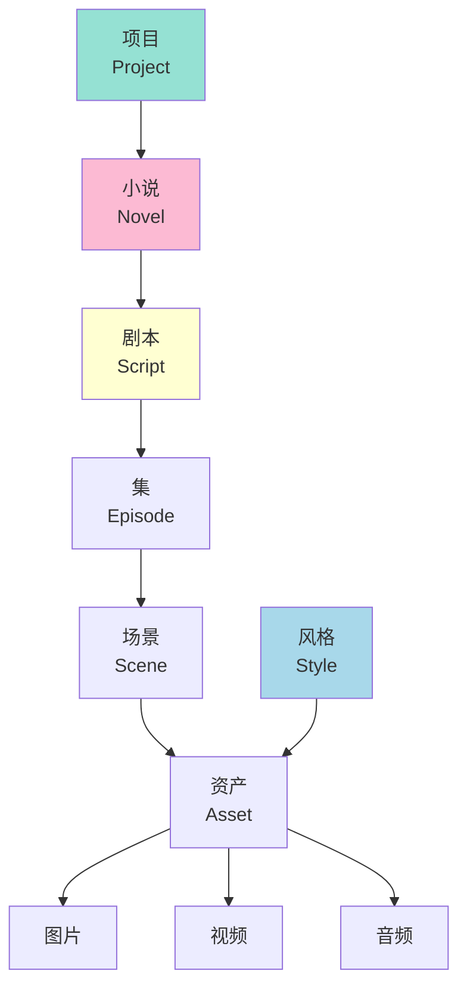
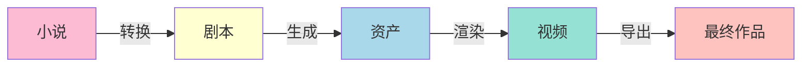

# ClipCraft 术语表

## 核心概念关系

## 核心概念

| 术语 | 英文 | 定义 | 示例 |
|------|------|------|------|
| 项目 | Project | 一个完整的创作单元，包含小说、剧本、资产等 | "《三体》短剧项目" |
| 小说 | Novel | 原始文本内容，作为创作的起点 | 用户上传的网络小说 |
| 剧本 | Script | 从小说转换而来的结构化剧本 | 包含场景、对话、动作描述 |
| 集 | Episode | 剧本的分集单位 | 第1集、第2集 |
| 场景 | Scene | 剧本中的最小单位，包含视觉和音频描述 | "场景1：外景，夜晚，城市街道" |
| 资产 | Asset | AI 生成的多媒体内容 | 图片、视频、音频 |
| 风格 | Style | 视觉风格定义，用于指导 AI 生成 | "赛博朋克"、"水墨画" |

## AI 相关

| 术语 | 英文 | 定义 | 示例 |
|------|------|------|------|
| 提示词 | Prompt | 给 AI 的指令文本 | "生成一个赛博朋克风格的城市夜景" |
| 提示词模板 | Prompt Template | 可复用的提示词结构 | "{style}风格的{scene_description}" |
| 供应商 | Provider | AI 服务提供商 | OpenAI、Anthropic、Google |
| 模型 | Model | AI 模型名称 | GPT-4o、Claude 3、Gemini |
| 流式响应 | Streaming | 实时返回 AI 生成内容 | 打字机效果显示文本 |
| 工具调用 | Tool Use | AI 调用外部功能的能力 | AI 调用"生成图片"工具 |

## 技术术语

| 术语 | 英文 | 定义 | 示例 |
|------|------|------|------|
| Feature | Feature | 按业务功能组织的代码单元 | novel feature、script feature |
| 聚合根 | Aggregate Root | DDD 中的核心实体，管理一组相关对象 | Project 是 Novel 的聚合根 |
| 值对象 | Value Object | 无唯一标识，按值比较的对象 | Email、Url、Prompt |
| 实体 | Entity | 有唯一标识的对象 | Novel、Script、Scene |
| Hook | Hook | React 中的可复用逻辑 | useNovel、useScript |
| Store | Store | 状态管理容器 | novelStore、projectStore |

## 业务流程

| 术语 | 英文 | 定义 | 示例 |
|------|------|------|------|
| 转换 | Conversion | 小说 → 剧本的过程 | AI 自动转换 |
| 生成 | Generation | 剧本 → 资产的过程 | 生成图片、视频 |
| 渲染 | Rendering | 将资产组合成最终视频 | 合成场景视频 |
| 导出 | Export | 输出最终作品 | 导出 MP4 文件 |

## 工具链

| 术语 | 英文 | 定义 | 官网 |
|------|------|------|------|
| Bun | Bun | JavaScript 运行时和工具链 | bun.sh |
| Turborepo | Turborepo | Monorepo 构建系统 | turbo.build |
| Elysia | Elysia | Bun 原生 Web 框架 | elysiajs.com |
| Vite | Vite | 前端构建工具 | vitejs.dev |
| BiomeJS | BiomeJS | 代码格式化和检查工具 | biomejs.dev |
| Drizzle | Drizzle | TypeScript ORM | orm.drizzle.team |
| Tauri | Tauri | 跨平台桌面应用框架 | tauri.app |
| Vercel AI SDK | Vercel AI SDK | AI 调用统一接口 | sdk.vercel.ai |
